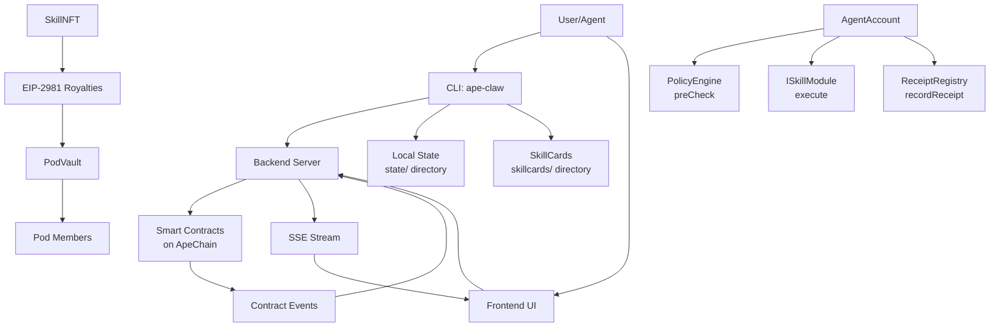

# Architecture

## System Overview

ApeClaw is an onchain AI agent ecosystem on ApeChain. It consists of:

### Components

1. **Smart Contracts** (Solidity, deployed on ApeChain)
   - **SkillNFT** — NFT representation of skills (one token per skill)
   - **SkillRegistry** — Version and metadata storage (append-only version log)
   - **IntentRegistry** — Agent intent publishing (for solver-style architectures)
   - **ReceiptRegistry** — Execution audit trail (append-only receipts)
   - **PodVault** — Revenue sharing vault (receives SkillNFT royalties)
   - **AgentAccount** — Agent execution shell (enforces PolicyEngine, records receipts)
   - **PolicyEngine** — Safety guardrails (allowlists + value caps)
   - **Modules** (Swap, Bridge, NftBuy) — Executable skill implementations

2. **Backend Server** (`src/server/index.mjs`, modular architecture)
   - Telemetry server with SSE event streaming (Last-Event-ID support)
   - REST API for skills, pods, clawbot management, quotes, bridge requests
   - Middleware: CORS allowlist, rate limiting, body size limits, auth
   - Storage abstraction: file-based (default) or SQLite backend
   - Structured logging via `pino`
   - Static file server for the UI
   - In-memory skill index with caching (60s TTL)
   - Legacy monolith still available at `src/telemetry-server.mjs`

3. **CLI** (`ape-claw`, entry: `src/cli/index.mjs` → delegates to `src/cli.mjs`)
   - Onchain operations (mint, publish, execute)
   - Clawbot registration and management
   - NFT purchasing and bridging
   - Pod workspace management

4. **Frontend** (HTML in `ui/`, extracted CSS in `ui/css/`, JS in `ui/js/`)
   - Dashboard with live event feed (`ui/index.html` + `ui/css/dashboard.css` + `ui/js/dashboard.js`)
   - Skills Library (`ui/skills.html` + `ui/css/skills.css` + `ui/js/skills.js`)
   - Pod management (`ui/pod.html`)
   - Documentation viewer (`ui/docs.html`)
   - Shared components: sidebar nav, motion effects

## Data Flow



### Execution Flow

1. **Skill Minting & Publishing**:
   ```
   CLI → SkillNFT.mintSkillWithRoyalty() → SkillRegistry.publishVersion()
   ```

2. **Module Execution**:
   ```
   CLI → AgentAccount.executeSkill() → PolicyEngine.preCheck() → ISkillModule.execute() → ReceiptRegistry.recordReceipt()
   ```

3. **Event Streaming**:
   ```
   Contract Events → Backend (SSE) → Frontend UI
   ```

## State Management

### Onchain State

Contracts deployed on ApeChain store:

- **SkillNFT**: Ownership and provenance (one NFT per skill)
- **SkillRegistry**: Immutable version log (`skillId` → `SkillVersion[]`)
- **IntentRegistry**: Active intents for solver competition
- **ReceiptRegistry**: Append-only execution receipts
- **PodVault**: Revenue shares and pending payments
- **PolicyEngine**: Allowlists (modules, targets, selectors) and value caps

Example deployment record (`state/v2-deployments/apechain.json`):

```json
{
  "skillNft": "0x...",
  "registry": "0x...",
  "intents": "0x...",
  "receipts": "0x...",
  "policy": "0x...",
  "agentAccount": "0x...",
  "podVault": "0x...",
  "modules": {
    "swap": "0x...",
    "bridge": "0x...",
    "nftBuy": "0x..."
  },
  "chainId": 33139,
  "network": "apechain"
}
```

### Local State

The `state/` directory contains:

- **`v2-deployments/`**: Deployment records per network
- **`skillcards-user/`**: User-submitted SkillCards
- **`quotes.json`**: NFT purchase quotes
- **`bridge-requests.json`**: Bridge request records
- **`events.jsonl`**: Telemetry events (appended by CLI/server)
- **`chat.jsonl`**: Chat messages
- **`invites.json`**: Registration invite tokens
- **`apeclaw.db`**: SQLite database (when `APE_CLAW_STORAGE=sqlite`)

The `config/` directory contains:

- **`clawbots.json`**: Registered clawbot configurations
- **`policy.json`**: Safety policy rules

### Skill Library

SkillCards are stored in:

- **`skillcards/seed/`**: Seed skills (trusted, vetted)
- **`skillcards/imported/`**: Imported skills from external sources
- **`skillcards/imported/index.json`**: Index of imported skills

The backend merges all three sources into a unified index (cached for 60 seconds):

```javascript
// From storage backend (file-backend.mjs or sqlite-backend.mjs)
function buildMergedSkillIndex() {
  const merged = [];
  // 1. Read seed skills from skillcards/seed/*.json
  // 2. Read imported skills from skillcards/imported/index.json
  // 3. Read user skills from state/skillcards-user/index.json
  return merged;
}
```

### Pod Workspace

Configurable directory (default: `pod/`) with:

- **`AGENTS.md`**: Agent configuration and capabilities
- **`SOUL.md`**: Agent identity and preferences
- **`memory/`**: Persistent memory storage
- **`journal/YYYY-MM-DD.md`**: Daily execution logs
- **`executions/*.json`**: Execution audit trail

## Contract Interactions

### Skill Lifecycle

```solidity
// 1. Mint SkillNFT
SkillNFT.mintSkillWithRoyalty(parentId, podVault, 500); // 5% royalty

// 2. Publish version to SkillRegistry
SkillRegistry.publishVersion(
  skillId,
  versionHash,    // keccak256(version_string)
  contentHash,   // keccak256(canonical_json)
  uri,           // ipfs://... or file://...
  riskTier       // 0-3 (unknown, low, medium, high)
);
```

### Module Execution

```solidity
// AgentAccount.executeSkill() flow:
// 1. PolicyEngine.preCheck(module, target, selector, value)
// 2. ISkillModule.execute(agentAccount, input)
// 3. ReceiptRegistry.recordReceipt(traceIdHash, contentHash, subjectHash, uri)

// Example: SwapModule
AgentAccount.executeSkill(
  swapModule,                    // module address
  abi.encode(target, calldata),  // input: (address, bytes)
  value,                         // ETH value
  traceIdHash,                   // execution trace ID
  subjectHash,                   // agent/skill identifier
  uri                            // receipt metadata URI
);
```

### Policy Enforcement

The `PolicyEngine` enforces three allowlists:

```solidity
// From PolicyEngine.sol
function preCheck(address module, address target, bytes4 selector, uint256 value) external view {
    require(allowedModules[module], "module blocked");
    require(value <= maxValuePerTx, "value over cap");
    require(allowedTargets[target], "target blocked");
    require(allowedSelectors[target][selector], "selector blocked");
}
```

Registration example (from `deploy-and-seed-v2-alpha.js`):

```javascript
await policy.write.setMaxValuePerTx([parseEther("1")]);
await policy.write.setModuleAllowed([swapModule.address, true]);
await policy.write.setTargetAllowed([targetAddress, true]);
await policy.write.setSelectorAllowed([targetAddress, selector, true]);
```

## Backend Architecture

### Modular Server (`src/server/`)

The backend is organized into a modular structure:

```
src/server/
  index.mjs           # Main entry point, request routing, safeHandler wrapper
  sse.mjs             # SSE client management, broadcast, Last-Event-ID support
  logger.mjs          # Structured logging (pino)
  middleware/
    cors.mjs          # CORS allowlist (built-in, includes apeclaw.ai + localhost variants)
    rate-limit.mjs    # In-memory sliding-window rate limiter
    body-limit.mjs    # Request body size limits
    auth.mjs          # Agent/admin auth (requireSkillWriteAuth, resolveChatAuth)
  routes/
    health.mjs        # GET /api/health
    events.mjs        # SSE stream, backlog, POST /api/events
    skills.mjs        # Skills search, get, stats, user skillcards
    clawbots.mjs      # Clawbot list, verify, register, invites
    chat.mjs          # Chat stream, rooms, messages, reactions
    v2.mjs            # V2 config, receipt get
    pod.mjs           # Pod status, stop
    quotes.mjs        # Quote/bridge-request CRUD, spend-today
    static.mjs        # Static files, rewrites, allowlist, policy
  storage/
    index.mjs         # Storage abstraction (initStorage, getStorage, storageEvents)
    file-backend.mjs  # File-based storage (default)
    sqlite-backend.mjs # SQLite storage (APE_CLAW_STORAGE=sqlite)
```

Key endpoints:

- `GET /api/skills/search`: Merged skill index (seed + imported + user)
- `POST /api/skillcards/user/add`: Submit new SkillCard (requires auth)
- `GET /events/backlog?limit=300&since=<ts>`: Historical events
- `GET /events`: SSE stream with `id:` fields and Last-Event-ID reconnect support
- `POST /api/clawbots/register`: Register clawbot
- `POST /api/quotes`: Create quote (centralized state for multi-machine)
- `GET /api/quotes/spend-today`: Server-side daily spend (global enforcement)

### Event System

Events flow through the storage abstraction and are broadcast via an EventEmitter:

```javascript
// Storage backend emits events
storageEvents.emit("telemetryEvent", evt);

// SSE module broadcasts to connected clients
function sendSse(res, data, id) {
  if (id !== undefined) res.write(`id: ${id}\n`);
  res.write(`data: ${JSON.stringify(data)}\n\n`);
}
```

## CLI Architecture

The CLI (`src/cli.mjs`) handles:

- **Onchain Operations**: Minting, publishing, executing via viem
- **Policy Enforcement**: Loading and validating policy.json
- **Market Discovery**: Reservoir/OpenSea API integration
- **Bridge Execution**: Relay protocol integration
- **Telemetry**: Emitting events to backend

Example CLI flow (NFT purchase):

```javascript
// 1. Quote
const quote = await quoteBuy({ collection, tokenId, maxPrice });

// 2. Simulate
const sim = await simulateBuy({ quoteId });

// 3. Execute (with confirm phrase)
const result = await executeBuy({ quoteId, confirm, execute: true });
```

## Revenue Flow

SkillNFT royalties flow to PodVault:

1. **Royalty Setup**: `SkillNFT.mintSkillWithRoyalty(parentId, podVault, 500)` sets 5% royalty
2. **Marketplace Payment**: When skill is sold, marketplace pays royalty to PodVault
3. **Member Release**: Pod members call `PodVault.releaseNative(member)` to claim their share

```solidity
// From PodVault.sol
function pendingNative(address member) public view returns (uint256) {
    uint256 s = shares[member];
    if (s == 0) return 0;
    uint256 totalReceived = address(this).balance + totalReleasedNative;
    uint256 already = releasedNative[member];
    return (totalReceived * s) / totalShares - already;
}
```

## Network Configuration

ApeClaw supports:

- **ApeChain** (chainId: 33139): Production network
- **Hardhat Local** (chainId: 31337): Development network

RPC URLs are configured via environment variables:

```bash
export APE_CLAW_V2_RPC_URL=https://apechain-rpc.example.com
export APE_CLAW_V2_PRIVATE_KEY=0x...
```

Deployment records are stored per network in `state/v2-deployments/<network>.json`.
